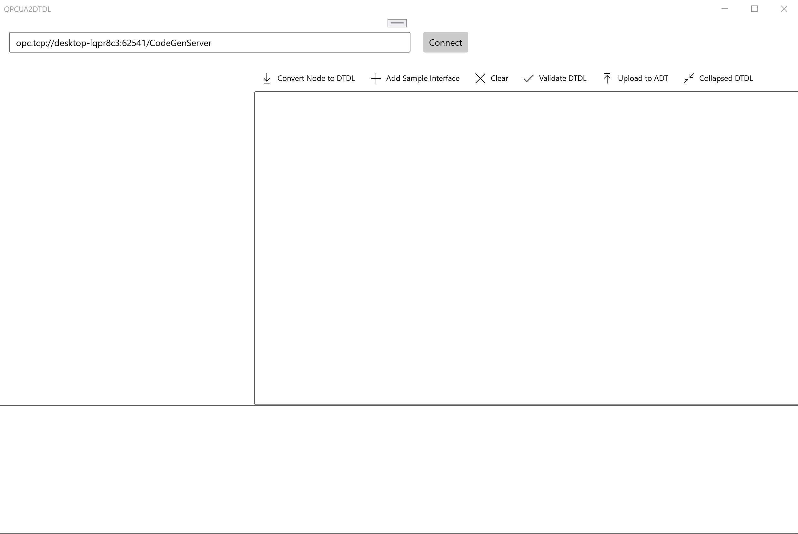

# OPCUA2DTDL
OPC UA to DTDL v2 Conversion Tool built using UWP./NET and the [OPC Foundation OPC UA .NET SDK](http://opcfoundation.github.io/UA-.NETStandard/).

## Instructions
Connect and browse an OPC UA server, select nodes and convert them to [DTDL v2](https://github.com/Azure/opendigitaltwins-dtdl/blob/master/DTDL/v2/dtdlv2.md).

The Root\Types folder contains the OPC UA base information model, custom models (if any) and companion specifications (if any) that have been loaded into that OPC UA server. These can be converted to DTDL v2 constructs using two patterns:

- **Collapsed pattern** – where OPC UA ObjectTypes, along with related properties, variables and methods, are collapsed down into a single DTDL Interface (Many:1) containing property, telemetry and command types.
- **Expanded pattern** – where every OPC UA DataType, ObjectType, VariableType etc. is mapped to an equivalent DTDL Interface (1:1) and DTDL Relationships are created based on OPC UA References.

